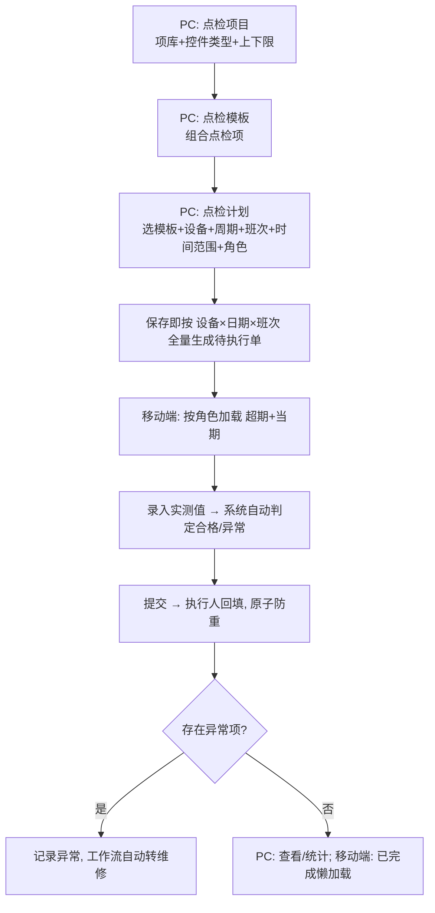
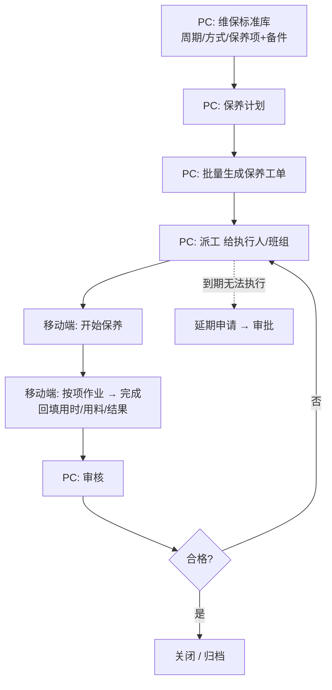
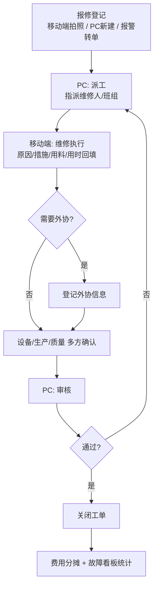

# 点检 / 维修 / 保养 操作流程说明

> 适用系统：arbore TPM 设备管理系统
> 角色约定：**PC 端**用于"配置、计划、派工、审核、统计"；**移动端**用于"现场执行（扫码、拍照、录入结果）"。

---

## 一、总览

| 业务 | 配置（PC） | 计划/工单（PC） | 现场执行 | 审核/归档（PC） |
|------|-----------|----------------|----------|----------------|
| 点检 | 点检项目 + 点检模板 | 点检计划 → 点检执行单 | 移动端按角色加载、录入实测值自动判定 | 异常结果记录（维修单由工作流自动生成） |
| 保养 | 维保标准库 / 保养模板 | 保养计划 → 批量生成工单 → 派工 | 移动端开始/完成保养 | PC 审核关闭 |
| 维修 | （工单模板，可选） | 报修单（PC 或移动端发起） | 移动端维修、回填 | 派工 → 维修 → 审核 → 关闭 |

---

## 二、点检流程（Inspection）

**菜单位置：设备点检 → 点检项目 / 点检模板 / 点检计划 / 点检执行单**（移动端同名「点检执行单」）

### 操作步骤
1. **维护点检项目**（`点检项目`，复用 `Facility_Item` Type=点检）：可复用的点检项库。每项含项目名称、点检方法、**控件类型**（数值型 / 是否型）；数值型配置**上限/下限**（自动判定依据）。
2. **配置点检模板**（`点检模板`，复用 `Facility_TheTemplateMain/Sub` Type=点检）：把若干点检项组合为模板（主表 + 明细），明细继承控件类型与上下限。一套模板可被多台设备复用。
3. **制定点检计划**（`点检计划`）：选择 1 个**点检模板** + **多台设备**（设备选择层）+ **周期**（日/周/月/季/年）+ **班次**（可多选，作备注性质；如勾「白班/夜班」则同一天各生成 1 张，不限时段均可填）+ **起止日期（时间范围）** + **执行角色（可多选）**。计划**不指定具体执行人**，按角色分配。
4. **生成执行单**：保存计划即按「**每台设备 × 时间范围内每个到期日 × 每个班次**」**一次性生成全部待执行单**（执行人留空）。**编辑计划**时先**清除本计划下未执行的待办**再按新范围重新生成（已完成的保留）。
5. **PC 点检执行单**（`点检执行单`）：**仅查看/统计/删除，不能执行**。
6. **移动端执行**：移动端**按当前登录人所属角色**加载「**超期未点检 + 当期未执行**」清单（当期按周期：日=当天[当天所有班次]、周=本周、月=本月、季=本季、年=本年），可扫码/输入设备编码定位；进入执行单 → 按模板逐项**录入实测值**（数值型填数值、是否型选是/否）→ 提交。**系统按上下限/是否自动判定合格或异常，不允许手动选是否合格**。多人可见同一单，提交时原子防重，已被他人完成则提示「无需重复提交」；提交时由当前登录人回填执行人。
7. **已完成**：移动端「已完成」页查看**本人已执行**的执行单，**懒加载分页**（数据增长不影响性能）。
8. **异常处理**：异常项仅记录结果（整单 Result=异常）；**是否生成维修单由工作流自动产生**，本模块不直接处理。

> 数据模型：`Facility_Item`(Type=点检，点检项库) / `Facility_TheTemplateMain`+`Facility_TheTemplateSub`(Type=点检，点检模板主子) / `Inspect_Plan`（模板×多设备×周期×班次×时间范围，按角色分配，不绑定执行人）/ `Inspect_PlanDevice`（计划-设备）/ `Inspect_PlanRole`（计划-角色）/ `Inspect_Record`（按设备×日期×班次生成的执行单）/ `Inspect_RecordSub`（逐项结果，含控件类型与上下限，自动判定）。

---

## 三、保养流程（Maintenance）

**菜单位置：设备保养 → 维保标准库 / （保养计划）/ 保养工单；延期申请；资质有效期监控**

### 操作步骤
1. **配置维保标准库**（`维保标准库`）：维护标准编号、设备/设备类型、周期类型（日常/周/月度/季度/年度）、维保方式（自维/外委）、保养项明细（保养项 + 备件 + 数量）。
2. **制定保养计划**：按标准与周期生成保养计划。
3. **批量生成工单 + 派工**（PC）：由计划批量生成保养工单（`Facility_BillMain`，BillType=保养），分派给执行人/班组。
4. **现场执行**（移动端）：执行人开始保养 → 按项作业 → 完成并回填（用时、用料、结果）。
5. **延期申请**（`延期申请`）：到期无法执行时提交延期，走审批。
6. **审核关闭**（PC）：班组长/设备员审核工单，合格后关闭归档。
7. **资质监控**（`资质有效期监控`）：维保资质三色到期预警（正常/临近/已过期）。

---

## 四、维修流程（Repair）

**菜单位置：设备维修 → 报修单 / 维修工单模板 / 费用分摊 / 报警规则 / 报警记录 / 故障看板**

### 发起方式
- **移动端报修**：现场人员拍照 + 填写故障描述，选择设备后提交。
- **PC 报修**：PC 端新建报修单（设备用放大镜选择，派工等流程字段不可手填，由系统流程生成）。
- **报警自动触发**：报警规则命中后写报警记录，可转预防性维修工单。

### 流程阶段
1. **报修登记**：填写设备、故障现象、报修人/时间。
2. **派工**：维修负责人指派维修人/班组（PC，自动生成派工信息）。
3. **维修执行**（移动端）：维修人到场，记录故障原因、维修措施、用料、用时，回填结果。
4. **外协（可选）**：需外委时登记外协信息。
5. **审核 / 确认**：设备 / 生产 / 质量多方确认。
6. **关闭**：审核通过后关闭工单。
7. **费用分摊 / 看板**：在`费用分摊`登记维修费用；`故障看板`查看 MTTR、故障趋势等统计。

### 状态说明（报修单）
| 阶段 | 说明 | 操作端 |
|------|------|--------|
| 待派工 | 报修已登记，等待指派 | 移动端/PC 发起 |
| 已派工 | 已指派维修人 | PC |
| 维修中 | 维修人现场作业 | 移动端 |
| 待审核 | 维修完成待确认 | 移动端提交 |
| 已关闭 | 审核通过，归档 | PC |

> 说明：派工、维修、外协、审核、关闭等流程字段均由系统按阶段自动生成，PC 新建报修单时不可手工填写。

---

## 五、三者关系

- **点检**是日常预防的"探头"：发现异常 → 触发**维修**。
- **保养**是周期性预防：按标准计划执行，降低故障率。
- **维修**是故障响应 + 预防性维修的闭环：可由点检异常、报警规则、人工报修三种来源触发。
