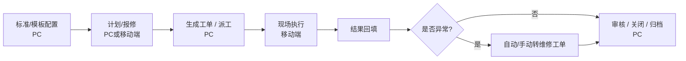
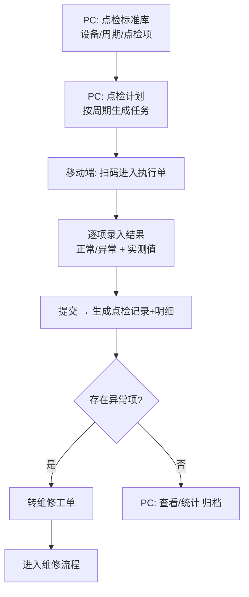
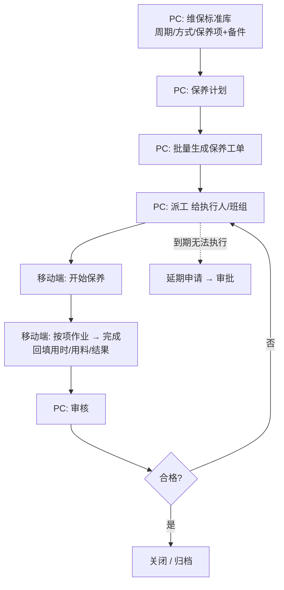
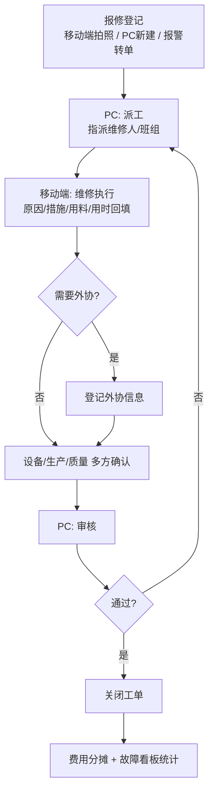

# 点检 / 维修 / 保养 操作流程说明

> 适用系统：arbore TPM 设备管理系统
> 角色约定：**PC 端**用于"配置、计划、派工、审核、统计"；**移动端**用于"现场执行（扫码、拍照、录入结果）"。

---

## 一、总览

| 业务 | 配置（PC） | 计划/工单（PC） | 现场执行 | 审核/归档（PC） |
|------|-----------|----------------|----------|----------------|
| 点检 | 点检标准库 | 点检计划 → 点检执行单 | 移动端扫码点检、录结果 | 异常自动转维修 |
| 保养 | 维保标准库 / 保养模板 | 保养计划 → 批量生成工单 → 派工 | 移动端开始/完成保养 | PC 审核关闭 |
| 维修 | （工单模板，可选） | 报修单（PC 或移动端发起） | 移动端维修、回填 | 派工 → 维修 → 审核 → 关闭 |

---

## 二、点检流程（Inspection）

**菜单位置：设备点检 → 点检标准库 / 点检计划 / 点检执行单**（移动端同名「点检执行单」）

### 操作步骤
1. **配置点检标准库**（`点检标准库`）：标准是「点检项的组合模板」，与具体设备解耦。维护标准编号（可自动生成）、**标准名称**、巡检周期、适用设备类型（可选）、编制人（员工放大镜），以及点检项明细（点检项 / 方法 / 标准）。一套标准可被多台/整类设备复用。
2. **制定点检计划**（`点检计划`）：选择 1 个点检标准 + **多台设备**（设备选择层，可按适用设备类型筛选）+ 起始日期 + 期数 + 执行人（员工放大镜）。保存后系统按「每台设备 × 每期」**逐张生成点检执行单**（待执行）。
3. **现场执行**（移动端 / PC）：进入待执行的点检执行单 → 逐项录入结果（正常/异常 + 实测值）→ 提交。提交后该单转为已完成。
4. **结果归集**（`点检执行单`）：记录主表 `Inspect_Record`（含设备、计划日期）+ 明细 `Inspect_RecordSub`。
5. **异常处理**：点检发现异常项（整单 Result=异常），可在 PC 执行单做异常处置分流（5 类），触发维修工单进入维修流程。

> 数据模型：`Inspect_Standard`（标准模板，去设备化）/ `Inspect_Plan`（标准×多设备×周期）/ `Inspect_PlanDevice`（计划-设备关联）/ `Inspect_Record`（按设备生成的执行单）/ `Inspect_RecordSub`（逐项结果）/ `Inspect_Disposal`（异常处置）。

---

## 三、保养流程（Maintenance）

**菜单位置：设备保养 → 维保标准库 / （保养计划）/ 保养工单；延期申请；资质有效期监控**

### 操作步骤
1. **配置维保标准库**（`维保标准库`）：维护标准编号、设备/设备类型、周期类型（日常/周/月度/季度/年度）、维保方式（自维/外委）、保养项明细（保养项 + 备件 + 数量）。
2. **制定保养计划**：按标准与周期生成保养计划。
3. **批量生成工单 + 派工**（PC）：由计划批量生成保养工单（`Facility_BillMain`，BillType=保养），分派给执行人/班组。
4. **现场执行**（移动端）：执行人开始保养 → 按项作业 → 完成并回填（用时、用料、结果）。
5. **延期申请**（`延期申请`）：到期无法执行时提交延期，走审批。
6. **审核关闭**（PC）：班组长/设备员审核工单，合格后关闭归档。
7. **资质监控**（`资质有效期监控`）：维保资质三色到期预警（正常/临近/已过期）。

---

## 四、维修流程（Repair）

**菜单位置：设备维修 → 报修单 / 维修工单模板 / 费用分摊 / 报警规则 / 报警记录 / 故障看板**

### 发起方式
- **移动端报修**：现场人员拍照 + 填写故障描述，选择设备后提交。
- **PC 报修**：PC 端新建报修单（设备用放大镜选择，派工等流程字段不可手填，由系统流程生成）。
- **报警自动触发**：报警规则命中后写报警记录，可转预防性维修工单。

### 流程阶段
1. **报修登记**：填写设备、故障现象、报修人/时间。
2. **派工**：维修负责人指派维修人/班组（PC，自动生成派工信息）。
3. **维修执行**（移动端）：维修人到场，记录故障原因、维修措施、用料、用时，回填结果。
4. **外协（可选）**：需外委时登记外协信息。
5. **审核 / 确认**：设备 / 生产 / 质量多方确认。
6. **关闭**：审核通过后关闭工单。
7. **费用分摊 / 看板**：在`费用分摊`登记维修费用；`故障看板`查看 MTTR、故障趋势等统计。

### 状态说明（报修单）
| 阶段 | 说明 | 操作端 |
|------|------|--------|
| 待派工 | 报修已登记，等待指派 | 移动端/PC 发起 |
| 已派工 | 已指派维修人 | PC |
| 维修中 | 维修人现场作业 | 移动端 |
| 待审核 | 维修完成待确认 | 移动端提交 |
| 已关闭 | 审核通过，归档 | PC |

> 说明：派工、维修、外协、审核、关闭等流程字段均由系统按阶段自动生成，PC 新建报修单时不可手工填写。

---

## 五、三者关系

- **点检**是日常预防的"探头"：发现异常 → 触发**维修**。
- **保养**是周期性预防：按标准计划执行，降低故障率。
- **维修**是故障响应 + 预防性维修的闭环：可由点检异常、报警规则、人工报修三种来源触发。
